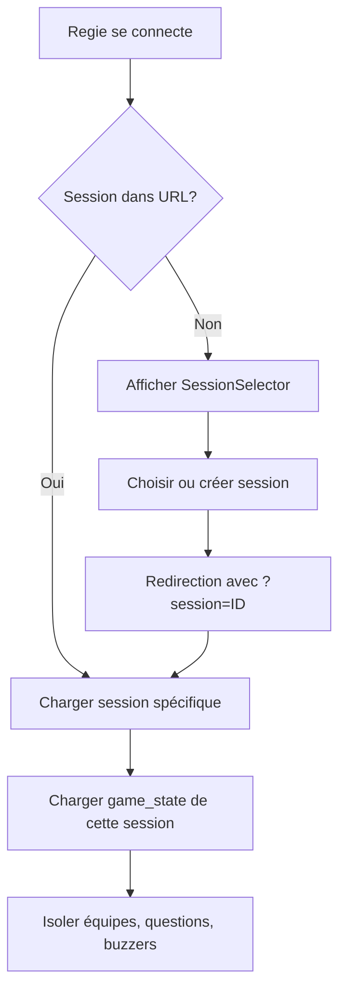

# 🎮 Guide du Système Multi-Session ARENA

## Vue d'ensemble

ARENA Live Quiz supporte maintenant **plusieurs sessions simultanées** ! Vous pouvez organiser plusieurs quiz en parallèle, chacun avec ses propres équipes, questions et état de jeu.

## ✨ Fonctionnalités

### 🔥 Ce qui a changé

- ✅ **Sessions illimitées en parallèle** - Organisez autant de quiz que nécessaire simultanément
- ✅ **Isolation complète** - Chaque session a ses propres équipes, scores, et état de jeu
- ✅ **Codes d'accès uniques** - Format "XXXX-YYYY-ZZZZ" généré automatiquement
- ✅ **Sélection de session** - Interface intuitive pour choisir ou créer une session
- ✅ **Dashboard multi-sessions** - Vue d'ensemble de toutes les sessions actives
- ✅ **Branding personnalisé** - Couleurs et logos par session

### 📋 Nouveaux composants

#### 1. **SessionSelector** (`/regie` sans paramètre)
- Liste toutes les sessions actives et à venir
- Permet de créer une nouvelle session
- Filtre et recherche de sessions
- Affiche le nombre d'équipes connectées par session

#### 2. **RegieWrapper** (wrapper intelligent)
- Gère la sélection de session via URL (`/regie?session=xxx`)
- Valide l'existence de la session
- Active automatiquement les sessions en brouillon
- Redirige vers SessionSelector si aucune session valide

#### 3. **AdminSessionsDashboard** (`/admin/sessions/dashboard`)
- Vue d'ensemble de toutes les sessions
- Statistiques en temps réel
- Contrôles de statut (activer, pause, terminer)
- Gestion complète des sessions

## 🗄️ Architecture de Base de Données

### Changements majeurs

```sql
-- game_state n'est plus un singleton !
ALTER TABLE game_state
  ADD COLUMN game_session_id UUID REFERENCES game_sessions(id);

-- Contrainte unique : un seul game_state par session
CREATE UNIQUE INDEX idx_game_state_unique_session
  ON game_state(game_session_id)
  WHERE game_session_id IS NOT NULL;
```

### Fonctions automatiques

```sql
-- Crée automatiquement un game_state pour chaque session active
CREATE TRIGGER trigger_auto_create_game_state
  AFTER INSERT OR UPDATE OF status ON game_sessions
  WHEN (NEW.status = 'active')
  EXECUTE FUNCTION auto_create_game_state();
```

### Vues pratiques

```sql
-- active_sessions_with_state
-- Vue combinée sessions + game_state + stats équipes
SELECT * FROM active_sessions_with_state;
```

## 🚀 Comment utiliser

### Pour la Régie (Animateur)

1. **Accédez à** `/regie`
2. **Sélectionnez** une session existante OU créez-en une nouvelle
3. **Lancez** votre quiz normalement

**URL directe** : `/regie?session=<session-id>` pour ouvrir directement une session

### Pour les Clients (Joueurs)

Rien ne change ! Les clients se connectent comme avant :
- Via `/join/:accessCode`
- Le système associe automatiquement l'équipe à la bonne session

### Pour les Administrateurs

1. **Dashboard** : `/admin/sessions/dashboard`
2. **Voir toutes les sessions** avec stats en temps réel
3. **Contrôler** : activer, mettre en pause, terminer
4. **Supprimer** les sessions terminées

## 📊 Flux de données



## 🔒 Isolation des Données

Chaque session a :
- ✅ Son propre `game_state`
- ✅ Ses propres équipes (via `team.game_session_id`)
- ✅ Ses propres buzzers (via `buzzer_attempts.game_session_id`)
- ✅ Ses propres réponses (via `team_answers.game_session_id`)

**Aucune fuite de données** entre sessions !

## 📝 Routes

### Nouvelles routes
- `/regie` - SessionSelector ou Regie (selon URL param)
- `/regie?session=<id>` - Regie pour une session spécifique
- `/sessions/select` - Sélecteur de session standalone
- `/admin/sessions/dashboard` - Dashboard admin

### Routes existantes (inchangées)
- `/client/:teamId` - Interface client
- `/join/:accessCode` - Rejoindre une session
- `/screen` - Écran public

## 🎨 Personnalisation

Chaque session peut avoir :
- **Couleurs** : `branding_primary_color`, `branding_secondary_color`
- **Logo** : `branding_logo_url`
- **Background** : `branding_background_url`
- **Instructions** : `custom_instructions`
- **Type** : `quiz`, `blindtest`, `mixed`

## 🔧 Migration

### Appliquer la migration

```bash
# La migration est dans supabase/migrations/
# Elle sera appliquée automatiquement au prochain déploiement

# Ou manuellement :
supabase db push
```

### Compatibilité

✅ **100% rétrocompatible** avec les données existantes
- Les anciennes sessions sont automatiquement migrées
- Le singleton game_state est préservé si nécessaire

## 🐛 Dépannage

### "Aucun ID de session dans l'URL"
➡️ Accédez à `/regie` sans paramètre pour sélectionner une session

### "Session invalide"
➡️ La session a peut-être été supprimée. Créez-en une nouvelle.

### Les équipes ne voient pas la session
➡️ Vérifiez que la session est en statut `active` ou `paused`

### Le game_state n'existe pas
➡️ Le trigger devrait le créer automatiquement. Vérifiez les logs Supabase.

## 📚 Fonctions Utiles

```typescript
// Récupérer le game_state d'une session
const { data } = await supabase
  .rpc('get_game_state_for_session', { session_id: 'xxx' });

// Nettoyer les données d'une session
await supabase
  .rpc('cleanup_session_data', { session_id: 'xxx' });

// Créer un game_state pour une session
await supabase
  .rpc('create_game_state_for_session', { session_id: 'xxx' });
```

## 🎯 Best Practices

1. **Créez une session par événement** - Ne réutilisez pas les sessions entre événements
2. **Terminez les sessions** quand elles sont finies pour garder une vue propre
3. **Utilisez des noms descriptifs** - Ex: "Soirée d'entreprise Acme Corp - 15 Nov"
4. **Vérifiez le code d'accès** avant de le communiquer aux joueurs
5. **Dashboard régulier** - Consultez `/admin/sessions/dashboard` pour surveiller

## 🚀 Prochaines étapes

- [ ] Duplication de session (templates)
- [ ] Planification de sessions futures
- [ ] Analytics comparatives multi-sessions
- [ ] Export de données par session
- [ ] Archivage automatique

---

**Développé avec ❤️ pour ARENA Live Quiz**
